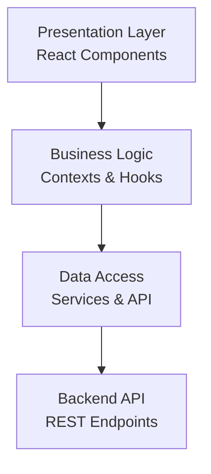
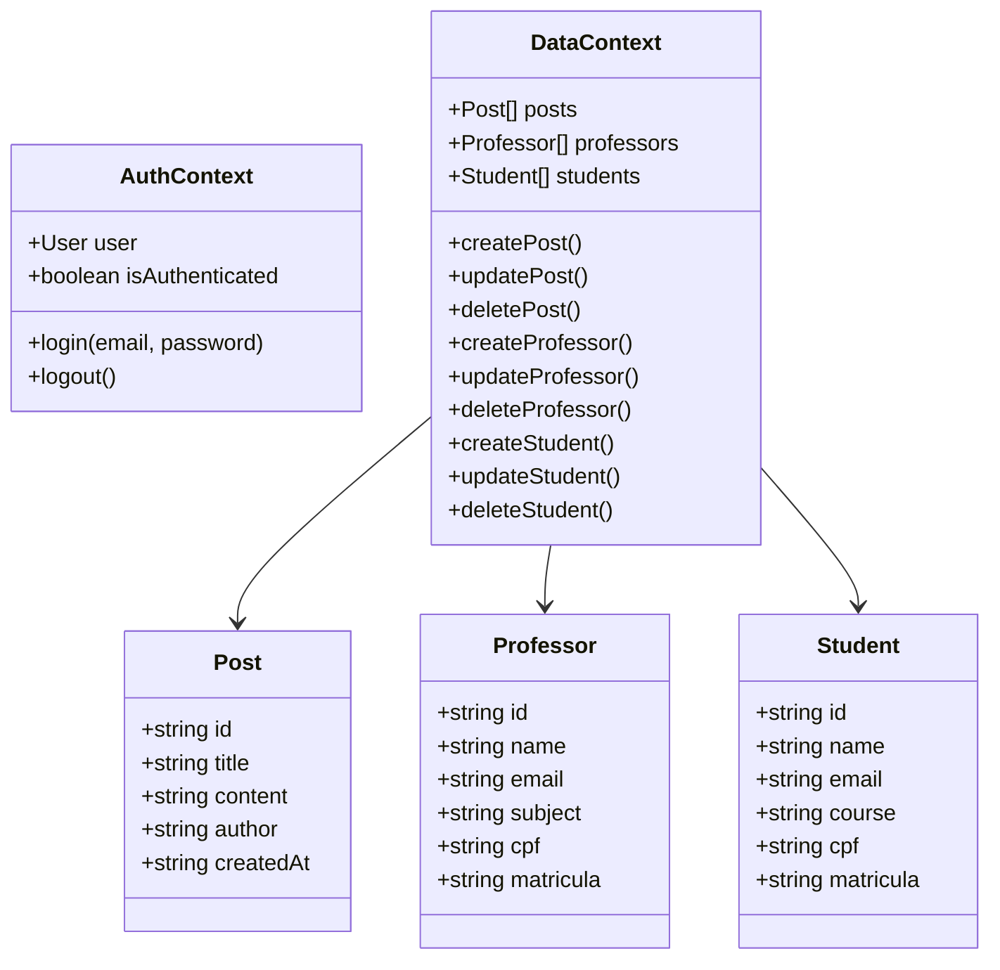
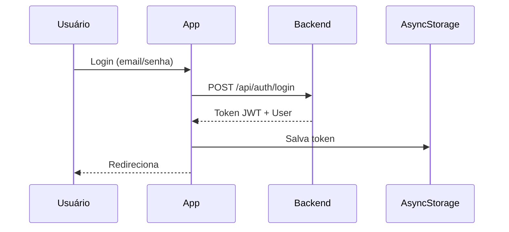
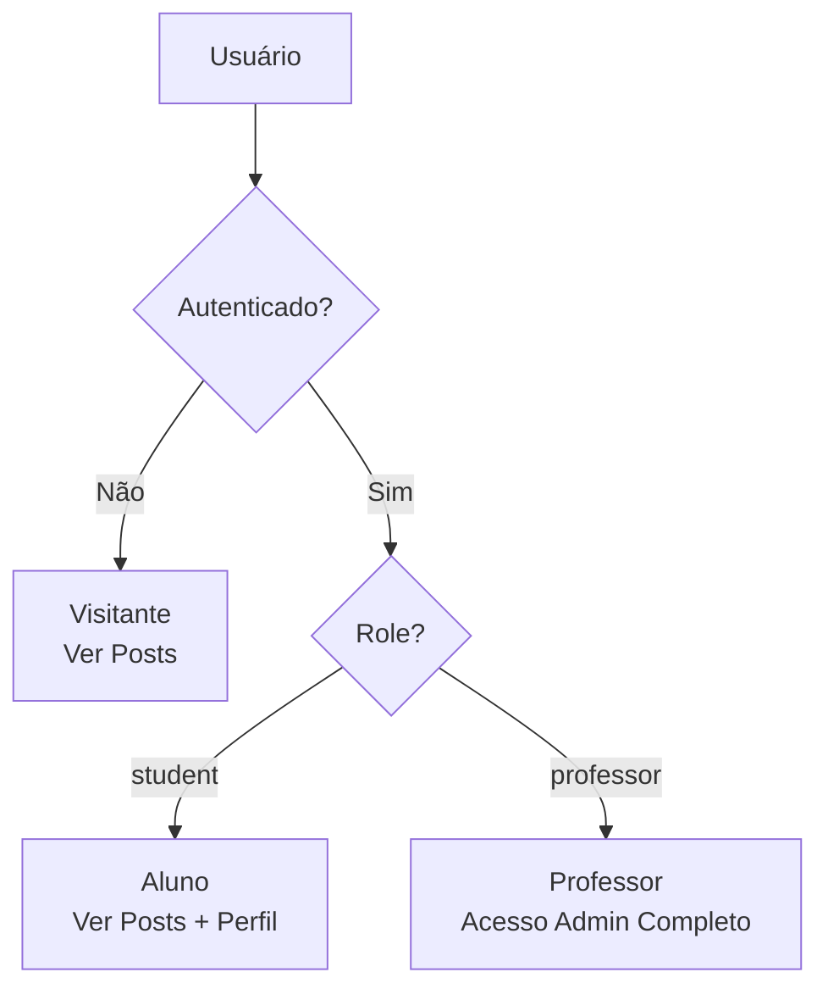
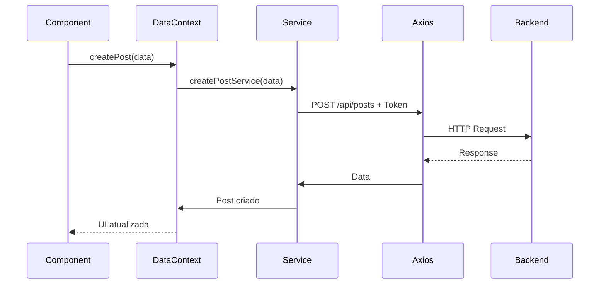

# Portal do Aluno - Aplicativo Mobile

> Aplicação mobile em React Native/Expo para gerenciamento educacional - Tech Challenge Fase 04

## 📋 Visão Geral

Sistema mobile multiplataforma que permite gestão completa de posts educacionais, professores e alunos. Professores possuem acesso administrativo completo, enquanto alunos podem visualizar posts e gerenciar seu perfil.

### Tecnologias Principais

- **React Native** + **Expo** - Framework mobile multiplataforma
- **TypeScript** - Tipagem estática
- **Expo Router** - Navegação file-based
- **Context API** - Gerenciamento de estado
- **Axios** - Cliente HTTP
- **AsyncStorage** - Persistência local

## 🏗️ Arquitetura

### Estrutura em Camadas



### Diagrama de Classes



## 📁 Estrutura do Projeto

```
app/                        # Rotas (file-based)
├── _layout.tsx            # Layout com Drawer
├── index.tsx              # Lista de posts
├── login.tsx              # Autenticação
├── admin.tsx              # Dashboard
├── posts/                 # CRUD de Posts
├── professors/            # CRUD de Professores
└── students/              # CRUD de Alunos

context/
├── auth/                  # Autenticação
│   ├── AuthContext.tsx
│   └── auth.service.ts
└── data/                  # Dados
    ├── DataContext.tsx
    └── use-cases/
        ├── posts.service.ts
        ├── professors.service.ts
        └── students.service.ts

services/
└── api.ts                 # Cliente HTTP (Axios)
```

## ✨ Funcionalidades

### Acesso Público

- ✅ Visualização de posts educacionais
- ✅ Busca por palavras-chave
- ✅ Leitura completa de posts

### Professores (Autenticados)

- ✅ CRUD completo de Posts
- ✅ CRUD completo de Professores
- ✅ CRUD completo de Alunos
- ✅ Dashboard administrativo

### Alunos (Autenticados)

- ✅ Visualização de posts
- ✅ Acesso ao perfil

## 🔐 Fluxo de Autenticação



### Estrutura de Permissões



## 🌐 Integração com API

### Endpoints Implementados

```
AUTH:
POST /api/auth/login              → Autenticação

POSTS:
GET    /api/posts                 → Listar
POST   /api/posts                 → Criar
PATCH  /api/posts/:id             → Atualizar
DELETE /api/posts/:id             → Remover

PROFESSORES:
GET    /api/teachers              → Listar
POST   /api/teachers              → Criar
PATCH  /api/teachers/:id          → Atualizar
DELETE /api/teachers/:id          → Remover

ALUNOS:
GET    /api/students              → Listar
POST   /api/students              → Criar
PATCH  /api/students/:id          → Atualizar
DELETE /api/students/:id          → Remover
```

### Ciclo de Requisição



## 🛠️ Instalação

### 1. Instalar Dependências

```bash
npm install
```

### 2. Configurar API

Edite `services/api.ts`:

```typescript
const API_BASE_URL = `http://SEU_IP:3333`;
```

**Descobrir IP:**

```bash
# Linux
ip addr show | grep "inet " | grep -v 127.0.0.1
```

### 3. Iniciar

```bash
npm start
```

Escaneie o QR Code com Expo Go (celular e PC na mesma rede Wi-Fi).

## 🔒 Segurança

- ✅ Token JWT em todas as requisições
- ✅ Persistência segura (AsyncStorage)
- ✅ Logout automático em token inválido (401)
- ✅ Controle de acesso por role
- ✅ Timeout de 10s nas requisições
- ✅ Validação client-side

## � Desafios e Experiências de Desenvolvimento

### Desafios Enfrentados

#### 1. Integração entre Mobile e Backend

**Desafio:** Comunicação entre dispositivo móvel e servidor local em redes diferentes.

**Solução:** Configuração do Axios com IP local da máquina e orientação para uso na mesma rede Wi-Fi. Implementação de timeout e tratamento de erros de conexão para melhor feedback ao usuário.

#### 2. Gerenciamento de Estado Global

**Desafio:** Sincronização de dados entre múltiplas telas e manutenção da consistência do estado.

**Solução:** Implementação de Context API com providers separados (Auth e Data), permitindo isolamento de responsabilidades e reutilização através de custom hooks.

#### 3. Mapeamento de Dados da API

**Desafio:** Backend retorna estruturas de dados diferentes do esperado pelo frontend (ex: `_id` vs `id`, campos ausentes).

**Solução:** Criação de camada de serviços com funções de mapeamento (`mapPostFromAPI`, `mapPostToAPI`) que normalizam os dados em ambas as direções.

#### 4. Autenticação Persistente

**Desafio:** Manter usuário logado entre sessões sem comprometer segurança.

**Solução:** Uso de AsyncStorage para token JWT com carregamento automático na inicialização do app e interceptors do Axios para renovação automática em cada requisição.

#### 5. Navegação File-based

**Desafio:** Migração do conceito tradicional de rotas para o modelo file-based do Expo Router.

**Solução:** Estudo da documentação do Expo Router v6 e organização da estrutura de pastas seguindo convenções (parâmetros dinâmicos com `[id].tsx`, layouts com `_layout.tsx`).

### Aprendizados Principais

- **TypeScript**: Tipagem estática preveniu diversos bugs em tempo de desenvolvimento
- **Context API**: Pattern eficiente para estado global em apps de médio porte
- **Expo**: Facilita drasticamente o desenvolvimento mobile sem necessidade de Android Studio/Xcode
- **Service Layer**: Separação entre lógica de negócio e acesso a dados melhora manutenibilidade
- **Async/Await**: Código mais legível para operações assíncronas comparado a Promises

### Boas Práticas Adotadas

- Separação de responsabilidades (apresentação, lógica, dados)
- Nomenclatura consistente de arquivos e variáveis
- Tratamento de erros em todas as operações assíncronas
- Loading states para feedback visual
- Validação de formulários antes do envio
- Confirmação para ações destrutivas (exclusões)

## �📊 Conclusão

O Portal do Aluno é uma solução mobile completa para gestão educacional, implementando:

- Arquitetura escalável baseada em Context API
- Integração REST com backend Node.js
- Sistema robusto de autenticação JWT
- Controle de permissões por role (professor/aluno)
- Interface responsiva e intuitiva
- Código TypeScript totalmente tipado

A aplicação demonstra domínio de conceitos essenciais de desenvolvimento mobile moderno, incluindo gerenciamento de estado global, navegação file-based, persistência de dados e integração com APIs REST.

---

**Tech Challenge - Fase 04** | Desenvolvido com React Native & Expo
